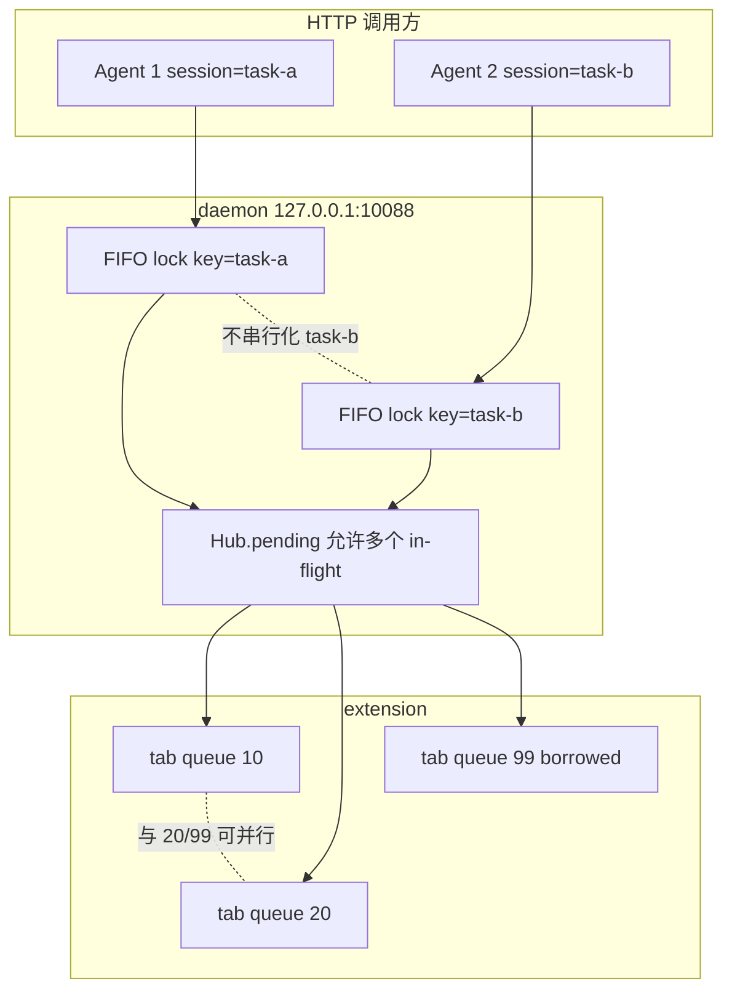
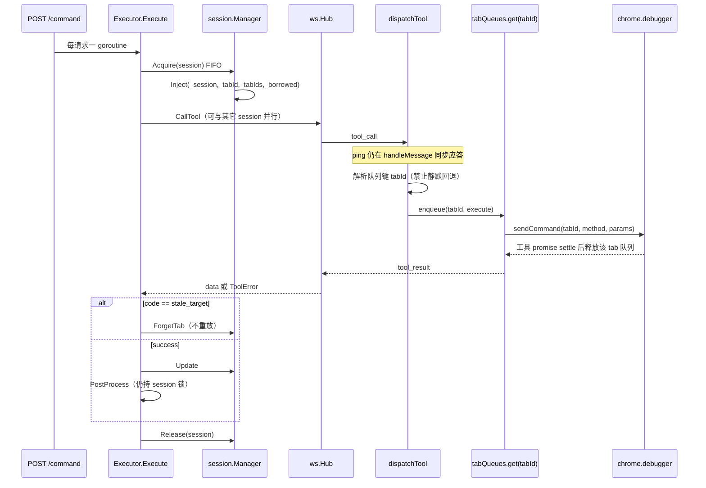
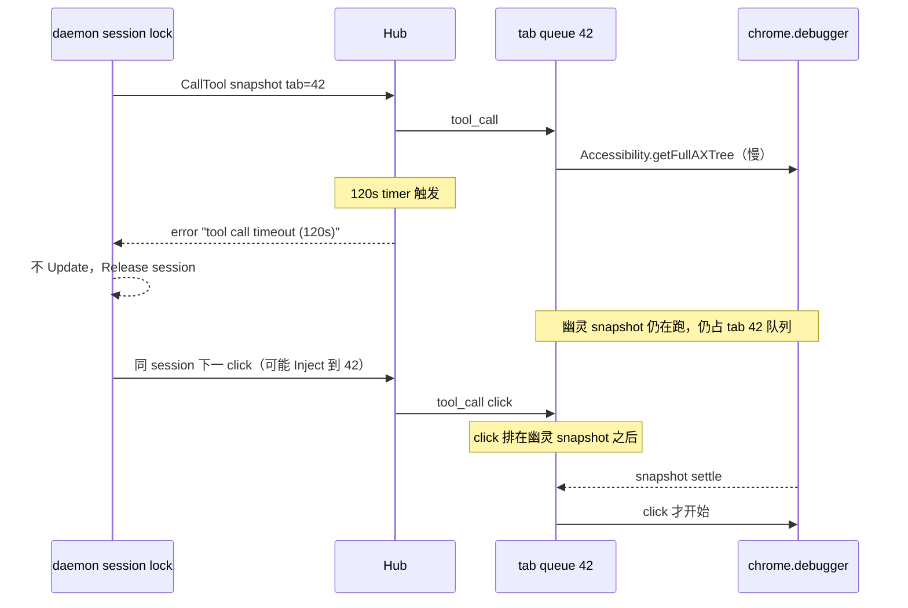

# CSI 目标隔离与并发模型（终态）

| 字段 | 值 |
|---|---|
| 日期 | 2026-08-31 |
| 作者 | — |
| 状态 | Draft |
| 适用范围 | daemon / extension / `docs/protocol.md` / skills（错误与 session 语义的一行同步） |
| 父文档 | [2026-08-31-agent-efficiency-accuracy-design.md](./2026-08-31-agent-efficiency-accuracy-design.md) |
| 取代 | 父文档 **阶段 A**（`WsClient` 全局工具队列）。阶段 A **取消，不实施**。 |

本文件是父文档 **阶段 B.5** 的可实施规格：直接落地「同 tab 串行、异 tab 并行、跨 session 借同一 tab 按 tab 串行、daemon 同 session 整段 `Execute` 串行」。不经过全局队列过渡态。

父文档阶段 C 的 **stale target 最小契约**（禁止静默回退、可选 `code`/`details`、不自动重放）一并纳入，否则队列键无法确定。父文档 B.1 的 **最小 currentTarget**（borrowed 可占据当前目标、但不进入 owned）也一并纳入，否则 `find_tab(active:true)` 之后的 `snapshot` 仍打到旧 owned tab——那是已经存在的顺序性错 tab，不是并发问题，但不修则「目标隔离」对借用路径无效。

不改阶段 D–F（snapshot 预算、技能拆分、MCP A/B）。

---

## Overview

CSI 的 CDP 竞态根因不是「少一条队列」，而是 extension 用进程级环境变量表示当前 target（`attachedTabId`、全局 `refTable`、全局 `contextByFrame`），再叠加 daemon 把 `Inject` 与 `Update` 做成两次短锁、中间 `CallTool` 无 session 事务。Chrome 的 `chrome.debugger.sendCommand({ tabId }, …)` 本身已按 tab 路由；`network.ts` 已按 `source.tabId` 分区，证明 debugger API 能隔离。Target / ref / frame 没有跟上。

终态是两层锁 + 显式 `TargetContext`，而不是先上全局串行再拆：

1. **Daemon**：按 session 名 FIFO，锁住完整 `Inject → CallTool → Update → PostProcess`。不同 session 互不阻塞。
2. **Extension**：按 Chrome `tabId` 的 promise 链串行。不同 `tabId` 允许重叠。`ping`/`pong`/`hello` 不进工具队列。
3. **状态**：每个 CDP 命令、每张 ref 表、每个 frame context 都带 `tabId`（ref 再加 `documentEpoch`）。删除作为命令目的地的全局 `attachedTabId`。

单 session 的 Agent 在 daemon 侧仍然整段串行，因此**不会**因为本改动而让同一 Agent 同时 snapshot 两个自己的 tab。Extension 的异 tab 并行主要兑现于**跨 session**（两个任务 / 两个 Agent），并作为 `dispatchTool` 被测试或未来非 daemon 调用方直接打中时的纵深防御。

---

## Background & Motivation

### 当前并发面（已对照代码）

JS 是单线程。这里没有 OS 线程撕开一条 `sendCommand`。`chrome.debugger.sendCommand({ tabId: attachedTabId }, …)` 在调用瞬间同步捕获 `tabId`，单条 CDP 命令不会半截改道。串话发生在**多步工具的 await 之间**：snapshot 清 ref → 等 AX 树 → 写 `@e`；click 查 `@e` → `DOM.resolveNode` → `Runtime.callFunctionOn`。

实际重叠窗口：

- Agent 宿主并行打工具。
- 两个 session 共用一个 daemon、一条 extension WS。
- `wait` 默认 15s、最长 120s（`WaitTool`，`MAX_TIMEOUT_MS = 120_000`）。
- daemon 工具超时默认 120s（协议 §3.3，`Hub.ToolTimeout`），超时只 `removePending`，**不会** abort 已发出的 `chrome.debugger.sendCommand`。

#### Extension：消息入口不排序

```238:247:extension/src/background/ws-client.ts
  private handleMessage(message: WsEnvelope): void {
    switch (message.type) {
      case 'ping':
        this.send({ type: 'pong' });
        break;
      case 'hello_ack':
        break;
      case 'tool_call':
        void this.handleToolCall(message);
        break;
```

`void this.handleToolCall(message)` 让多个 `tool_call` 的 `await` 交错。这是正确的消息泵形态（ping 必须能在长工具期间应答），**不要**在 `WsClient` 上加全局工具队列。排序下放到 dispatcher 的 per-tab 队列。

#### Extension：全局当前 target

```9:61:extension/src/background/debugger-session.ts
const attachedTabIds = new Set<number>();
let attachedTabId: number | null = null;
/** Last tab the user was seen actively using (fallback target). */
let lastUserTabId: number | null = null;
// ...
export async function sendCommand<T = any>(method: string, params?: object): Promise<T> {
  if (attachedTabId === null) {
    throw new Error('No tab attached. Call attach(tabId) first.');
  }
  return (await chrome.debugger.sendCommand({ tabId: attachedTabId }, method, params)) as T;
}

export function setAttachedTabId(tabId: number): void {
  attachedTabId = tabId;
}
```

`ensureAttached` 在 attach 集合之外还会写 `attachedTabId`。`registry.dispatchTool` 对非 `SESSION_SCOPED_TOOLS` 先 `ensureAttached(_tabId)` 再 `setAttachedTabId`，然后 **`delete args._tabId`**。工具体内用 `getCurrentTab()` 重新发现目标：

```42:49:extension/src/background/tab-manager.ts
export async function getCurrentTab(): Promise<chrome.tabs.Tab> {
  const tracked = await getTrackedTab();
  if (tracked) return tracked;
  const [active] = await chrome.tabs.query({ active: true, currentWindow: true });
  if (!active?.id) throw new Error('No active tab found');
  setLastUserTabId(active.id);
  return active;
}
```

回退链是 **attached → last-user → 当前窗口 active tab**。这与协议 §3.4「若该 id 已失效……必须静默回退」一致，也正是错 tab 的产品入口：stale `_tabId` 或 `_tabId === 0` 时，工具会操作用户正在看的页面。

`SESSION_SCOPED_TOOLS` 今天只有 `close_tab` / `list_tabs` / `close_session`（`registry.ts`）。**`navigate` 和 `find_tab` 不在其中**，因此 `navigate({newTab:true})` 会先 attach 到 session 旧 `_tabId`，再在 `NavigateTool.execute` 里建新 tab。`find_tab(active:true)` 同样先 attach 旧当前 tab，再 attach 借用 tab。dispatcher 的「先瞄准再执行」把解析目标与执行叠在了全局指针上。

#### Extension：全局 ref / frame，且任意 tab 关闭会清空全部

```37:43:extension/src/background/refs.ts
const refTable = new Map<string, RefEntry>();
let refCounter = 1;

export function resetRefs(): void {
  refTable.clear();
  refCounter = 1;
}
```

```176:209:extension/src/background/frames.ts
chrome.debugger.onEvent.addListener((source, method, params) => {
  if (source.tabId == null || source.tabId !== getAttachedTabId()) return;
  // ...
  } else if (method === 'Runtime.executionContextsCleared') {
    contextByFrame.clear();
  } else if (method === 'Page.frameNavigated') {
    const frame = (params as { frame?: { parentId?: string } }).frame;
    if (frame && !frame.parentId) {
      resetRefs();
      clearFrameCaches();
    }
  }
});

chrome.tabs.onRemoved.addListener(() => {
  resetRefs();
  clearFrameCaches();
});

chrome.debugger.onDetach.addListener(() => {
  resetRefs();
  clearFrameCaches();
});
```

三处独立的顺序性 bug：

1. `onEvent` 丢弃一切 `source.tabId !== getAttachedTabId()` 的事件——第二个已 attach 的 tab 的 context 永远进不了 cache。
2. `executionContextsCleared` / 主文档 `frameNavigated` 清的是**全进程** context/ref。
3. **任意** tab 的 `onRemoved` / **任意** debugger detach 调用无参 `resetRefs()`，把其它 tab 的 `@e` 一并清掉。`onRemoved` 的 listener 甚至不读 `tabId` 参数。

对比已经做对的 `network.ts`：

```37:40:extension/src/background/tools/network.ts
  chrome.debugger.onEvent.addListener((source, method, params) => {
    const tabId = source.tabId;
    if (!tabId || !capturingTabIds.has(tabId) || !params) return;
    const table = requestsFor(tabId);
```

捕获表按 tab 分区、事件按 `source.tabId` 扇出。但 `stop`/`list`/`detail` 仍走 `getAttachedTabId()`（`network.ts:101–135`），会在并行下读错表。不要回退分区，要把读路径改成显式 tabId。

`NavigateTool.execute` 在知道目标 tab 之前就 `resetRefs()`（`navigate.ts:24`），一次 navigate 会抹掉其它 tab 的 snapshot。这与「关 tab B 清掉 tab A 的 ref」是同一类全局表错误。

#### Daemon：HTTP 每请求一 goroutine，Execute 不是事务

```92:111:daemon/internal/server/server.go
func (s *Server) handleCommand(w http.ResponseWriter, r *http.Request) {
    // ...
    data, err := s.Executor.Execute(r.Context(), req.Action, req.Session, req.Args)
```

```83:110:daemon/internal/tools/tools.go
func (e *Executor) Execute(ctx context.Context, action, sess string, args map[string]any) (any, error) {
    // ...
    args = e.Sessions.Inject(sess, args)
    data, err := e.Backend.CallTool(ctx, action, args)
    if err != nil {
        return nil, err
    }
    e.Sessions.Update(sess, action, data)
    return PostProcess(action, args, data)
}
```

`session.Manager.Inject` / `Update` 各自 `mu.Lock()`，但两次锁之间的 `CallTool`（最长 120s）无 session 级互斥。两个 goroutine 可以对同一 session 读到同一个 `LastTabID`，再按完成顺序写回，于是 `LastTabID` 被后完成的调用翻转。

`Hub.CallTool`（`daemon/internal/ws/hub.go`）的 `pending map[string]pendingCall` 允许多个 in-flight `tool_call`；`writeMu` 只串行化写帧。这是对的：跨 session 并行必须能同时等两个 `tool_result`。不要在 Hub 上加全局 `CallTool` 互斥。

#### 顺序性错 tab：borrowed 不成为当前目标

协议 §3.4 与 `session.Update` 明确：`find_tab` 返回 `borrowed:true` 时不记入 `TabIDs`、不设 `LastTabID`（`session.go:86–90`，`TestUpdateBorrowedTabNotAdopted`）。HTTP 调用方不能传 `_tabId`（daemon 覆盖）。因此「借用只被当次工具就地操作」对 HTTP Agent 实际意味着：**下一轮 `snapshot` 会被重新瞄准旧 owned `LastTabID`**。

`FindTabTool` 还会 `setLastUserTabId(borrowed)` 并 `ensureAttached(borrowed)`。若旧 owned tab 仍在，下一轮 `dispatchTool` 优先 attach `_tabId`（owned），借用被盖掉；若 owned 已关，静默回退可能落到借用 tab 或用户 active tab。行为取决于谁先关 tab，不是契约。

### 痛点归纳

| 现象 | 机制 | 后果 |
|---|---|---|
| 两工具不同 `_tabId` 交错 | 全局 `attachedTabId` + `sendCommand` 重读 | CDP 打到别人的 tab |
| 两工具同一 `_tabId` 交错 | 无 per-tab 队列 | snapshot 的 ref 被另一 snapshot `resetRefs`；click 解析到错误节点 |
| 两 session 借同一用户 tab | 队列键若用 session 则平行 | 同上，外加两套 session 状态都以为自己独占 |
| 同 session 两个 `navigate newTab` | `Inject`/`Update` 非事务 | `LastTabID` 完成序翻转 |
| stale `_tabId` | 协议 §3.4 静默回退 | 操作用户正在看的页面 |
| `_tabId === 0` | `getCurrentTab` → active | 无 session 目标时猜用户前台 |
| 关任意 tab | `frames.ts` 无参 `resetRefs()` | 活着的 tab 的 `@e` 全部失效 |
| `find_tab(active:true)` 后 snapshot | borrowed 不更新 `LastTabID` | 打到旧 owned tab |

根因不是「缺队列」，是 CSI 发明了进程级当前 target。Chrome 没有要求这样做。

---

## Goals & Non-Goals

### Goals

1. 满足下面四条硬规则（不可意译放宽）。
2. 每个 CDP 命令的 destination 是参数里的 `tabId`，编译期即可发现「又读了全局指针」。
3. `@eN` 只在 `(tabId, documentEpoch)` 内有效；tab A 的 snapshot 不能覆盖 tab B 的 ref store。
4. stale / 缺失目标失败为错误，不静默落到 last-user / active tab。
5. 不先合并全局 `WsClient` 队列。本规格一次落到 B.5 终态。
6. 规格具体到：队列占用何时释放、锁包住哪些语句、每种工具的队列键如何解析，工程师不靠猜就能实现。

### Non-Goals

- 父文档阶段 D：snapshot match / contextual YAML / `max_chars` / artifact 信封。
- 父文档阶段 E：技能 token 拆分与 1,200 token 上限（本规格只允许错误/borrowed 语义的一行同步）。
- 父文档阶段 F：Codex MCP A/B。
- 合并 `click`/`mouse_click`，或把 21 个工具收成一个 meta-tool。
- 跨域 iframe、原生对话框、下载。
- 改安全边界（仍只绑 `127.0.0.1`，v1 无鉴权）。
- **`WsClient` 全局工具队列。**
- 父文档 B.4 第 4 步：mutating selector 动作在执行前重读 role/name。区分 `unknown_ref` / `stale_ref` 靠 epoch + `DOM.resolveNode`；role/name 复核单开 follow-up，避免本规格膨胀。
- 让单 session Agent 在 daemon 锁下并行操作它名下的两个 tab。若以后要放开，必须另开规格，显式放松规则 4。
- 改 HTTP 成功信封 `{success, data}`；失败信封可**附加**可选 `code`/`details`，旧客户端继续只读 `error`。

---

## 硬并发规则

必须逐字满足：

1. **同一 Chrome `tabId` → extension 里同一时刻只能有一个工具在执行**，不论来自哪个 session、哪个工具。
2. **不同 `tabId` → extension 允许并行**。只有在 CDP、ref store、frame/context cache 都不再使用环境全局量时，这才是安全的。
3. **两个 session 借用同一用户 tab → 同规则 1**。队列键是 `tabId`，不是 session 名。
4. **Daemon：同一 session 同一时刻只能有一个 in-flight `Execute`**，覆盖完整 `Inject → CallTool → Update`（`PostProcess` 放在同一把锁内，见下）。不同 session 可以并行。

规则 4 的直接推论，写清楚以免实现时「优化」掉：

> 单个 Agent、单个 session，即使它拥有两个 tab，在 daemon 侧仍然整段串行。响应完成顺序不能反转该 session 的 currentTarget。Extension 的异 tab 并行，主要收益是**跨 session**；对测试或绕过 daemon 直打 `dispatchTool` 是纵深防御。本规格**不**声称「一个 session 的 Agent 可以同时 snapshot 两个 tab」。

规则 3 与规则 4 正交，说两遍：

- Daemon session 锁**不**负责「两个 session 打同一个 borrowed tab」——那是 extension tab 队列的职责。
- Extension tab 队列**不**负责「同一 session 的 `LastTabID`/`CurrentTabID` 被乱序 Update」——那是 daemon session 锁的职责。



---

## Proposed Design

### 总览



### Extension：显式 `TargetContext`

dispatcher 在工具函数体运行**之前**构造：

```ts
export interface TargetContext {
  tabId: number;
  documentEpoch: number;
}
```

`Tool` 接口改为：

```ts
export interface Tool {
  readonly name: string;
  execute(args: ToolArgs, target: TargetContext): Promise<unknown>;
}
```

`list_tabs` 不操作页面，可传一个占位 `target`（`tabId: 0` 仅表示「无页面目标」，不得拿去 `sendCommand`），或让它忽略 `target`。推荐所有 `execute` 签名一致，避免 registry 分叉。

所有 CDP helper 改为显式 tabId（编译期掐死全局目的地）：

```ts
ensureAttached(tabId: number): Promise<void>
sendCommand<T>(tabId: number, method: string, params?: object): Promise<T>
```

不变量：

- `ensureAttached` **只**维护 `attachedTabIds: Set<number>`（哪些 tab 已 attach）。**禁止**再设置进程级「当前 tab」。
- `sendCommand` **永远** `chrome.debugger.sendCommand({ tabId }, method, params)`。函数体内不得读 `attachedTabId` / `getAttachedTabId()`。
- 删除 `setAttachedTabId`、`getAttachedTabId`、以及作为命令目的地的 `attachedTabId` 变量。
- `lastUserTabId` **不得**作为队列键，也不得作为普通工具的静默回退。`tab-manager.ts` 的 `getCurrentTab` / `getTrackedTab` 从工具路径删除（`navigate` 只在 `_tabId ∈ sessionTabIds()` 时 reuse，否则 `tabs.create`；`find_tab(active:true)` 继续用 `windows.getLastFocused`）。删除后残留引用会 typecheck 失败，这是故意的。
- `isAttached(tabId)` / `forgetAttached(tabId)` 保留。

`ensureAttached` 伪代码：

```ts
export async function ensureAttached(tabId: number): Promise<void> {
  if (attachedTabIds.has(tabId)) return;
  try {
    await chrome.debugger.detach({ tabId });
  } catch {
    /* not attached */
  }
  await chrome.debugger.attach({ tabId }, DEBUGGER_PROTOCOL_VERSION);
  await chrome.debugger.sendCommand({ tabId }, 'Page.enable', {});
  attachedTabIds.add(tabId);
  bumpEpoch(tabId, 'reattach'); // 见 documentEpoch：无法确认原文档生命周期
}
```

原先 `ensureAttached` 在已 attach 时仍写 `attachedTabId = tabId`（`debugger-session.ts:31–33`）。删掉这行。已 attach 时必须是 no-op，否则并行工具会把「当前指针」拨来拨去——指针本身就不应存在。

### Extension：per-tab promise 队列（不在 `WsClient`）

新模块 `extension/src/background/tab-queue.ts`（名称可调整，但必须独立于 `ws-client.ts`）。

```ts
const tails = new Map<number, Promise<void>>();

export function enqueueTab<T>(tabId: number, task: () => Promise<T>): Promise<T> {
  const prev = tails.get(tabId) ?? Promise.resolve();
  const run = prev.catch(() => {}).then(task);
  // 链不断：无论 task 成功失败，后继都能跑
  const tail = run.then(
    () => undefined,
    () => undefined,
  );
  tails.set(tabId, tail);
  return run;
}

export function dropTabQueue(tabId: number): void {
  tails.delete(tabId);
}
```

不变量：

1. **占用直到工具 promise settle**（fulfill 或 reject），不是直到 daemon HTTP/WS 超时。`Hub.CallTool` 超时只 `removePending` 并返回 `tool call timeout (120s)`（`hub.go:431–434`），扩展侧 `chrome.debugger.sendCommand` 仍在跑。若此时释放 tab 队列，重试或下一工具会与幽灵调用重叠，规则 1 立刻被打破。
2. 第一个工具 throw 必须释放队列，第二个同 tab 工具仍执行（`prev.catch(() => {})`）。
3. `wait` 占住**该 tab** 队列直到轮询结束（最长 120s）。其它 tab 的队列不受影响。`handleMessage` 对 `ping` 仍同步 `pong`。
4. socket 重连不重放 in-flight 工具（现状：`connDone` → `sweepPending` 报 `extension not connected`）。扩展侧已开始的 promise 继续跑到 settle，继续占 tab 队列。新连接上的新 `tool_call` 若瞄同一 tab，排在幽灵调用之后。
5. `dropTabQueue(tabId)` **只删 `tails` 的 Map 项，防止已关闭 tab 泄漏**；**不得** cancel、reject 或打断任何 in-flight / 已 chained 的 promise。占用仍直到那些 promise settle。允许从两处调用：关 tab 的 queued task 的 `finally`，以及 `chrome.tabs.onRemoved`。两处都调用是幂等的（`Map.delete` 两次无害）。已 chained 的后继仍挂在**旧** promise 链上，不会因为 `dropTabQueue` 另开第二条链而被取消。
6. 队列键是 Chrome 数值 `tabId`。禁止用 session 名、禁止用 `lastUserTabId`。
7. **关 tab 之后禁止再 `enqueueTab`。** tab 瞄准工具必须先 `resolveTabTarget`（`chrome.tabs.get`）；失败则 `stale_target` 并 return，**不得** `enqueueTab`。`onRemoved` 先于 dispatcher 跑时，新调用不会在已 `drop` 的 key 上开第二条链。`close_session` 只对 `sessionTabIds()` 里、解析时仍存在的 owned id 入队（见下）。

`WsClient.handleMessage` 保持今天的 `void this.handleToolCall(message)`。排序发生在 `onToolCall` → `dispatchTool` 内部。

### 队列键 / tab 解析（关键）

dispatcher（`registry.dispatchTool`）先分类，再决定是否 `enqueueTab`。**禁止**再走「对非 SESSION_SCOPED 先 `ensureAttached(_tabId)` 再 `delete _tabId`」这条默认路径。

| 分类 | 工具 | 队列键 | 解析失败 |
|---|---|---|---|
| 无 tab 队列 | `list_tabs` | 无。daemon session 锁已保证同 session 顺序 | — |
| 先解析再入队 | `find_tab` | 命中的 tabId | 未命中：现有错误字符串，不占任何队列 |
| 先解析再入队 | `navigate` | 见下 | stale / 创建失败 |
| 先解析再入队 | `close_tab` | 见下 | 无 tab / borrowed 拒关不占用户 tab 队列 |
| 先解析再入队 | `close_session` | **每个 owned tabId 各进一次队列** | — |
| tab 瞄准 | 其余 16 个：`snapshot` `click` `fill` `evaluate` `network` `mouse_click` `wait` `scroll` `hover` `key_type` `send_keys` `cdp` `screenshot` `save_as_pdf` `upload` `list_frames` | 已解析的数值 `_tabId` | `stale_target` / `no_session_target` |

16 + 5 = 21，与协议 §4 一致。

#### tab 瞄准工具

```ts
async function resolveTabTarget(args: ToolArgs): Promise<number> {
  const tabId = args._tabId;
  const session = typeof args._session === 'string' ? args._session : 'default';
  if (tabId == null || tabId === 0) {
    throw new ToolError(
      'session has no current tab; call navigate first, or find_tab(active:true) to borrow the user\'s tab',
      'no_session_target',
      { session },
    );
  }
  try {
    await chrome.tabs.get(tabId);
  } catch {
    throw new ToolError(
      `session target tab ${tabId} is no longer available`,
      'stale_target',
      { tabId, session },
    );
  }
  return tabId;
}
```

然后：

```ts
const tabId = await resolveTabTarget(args);
return enqueueTab(tabId, async () => {
  await ensureAttached(tabId);
  const ctx: TargetContext = {
    tabId,
    documentEpoch: currentEpoch(tabId),
  };
  return tool.execute(args, ctx);
});
```

硬性禁止：

- daemon 注入了非零 `_tabId` 且该 tab 已不存在：**不得**回退 last-user / active 来选队列键。报 `stale_target`。这是相对现行协议 §3.4「必须静默回退」的**行为破坏**，必要且故意：队列键必须确定，否则规则 1 的「同一 tab」没有稳定含义。
- `_tabId === 0`：普通 tab 瞄准工具报 `no_session_target`，**不得**猜用户 active tab。例外只有 `navigate`（无 owned 可复用时**新建**；不得复用 borrowed 用户 tab）和显式 `find_tab(active:true)`。

入队后再 attach。解析阶段只 `chrome.tabs.get`，不 attach，避免 `find_tab`/`navigate newTab` 误 attach 旧 tab（今日 `dispatchTool` 的实害）。

#### `navigate`

当前目标是 borrowed 时，**禁止**把用户 tab 当 session 页来 `Page.navigate` / `Page.reload` / `addToSessionGroup` / 收编进 `TabIDs`。否则 `close_session` 会 `tabs.remove` 用户正在看的页。这是 borrowed 成为 current 之后最高优先级的产品不变量，与「borrowed 永不进入 owned」同一条。

`owned = sessionTabIds(args)`（**只** `_tabIds`，见下，**永不**回退 `_tabId`）。

```text
canReuse = !_newTab
        && _tabId ≠ 0
        && _tabId ∈ owned          // 关键：borrowed / ∉ _tabIds 一律不能 reuse
        && chrome.tabs.get(_tabId) 成功
        && tab.url 不是 chrome:// 或 edge://

if canReuse:
    enqueue(_tabId, () => attach + Page.navigate|reload + waitForLoad)
    // 占 **owned** 旧 tab 队列；返回 { success, url, tabId: _tabId }（无 borrowed）
else if _tabId ∈ owned && get(_tabId) 失败 && !newTab:
    // owned 当前目标已关：stale_target，不要装成新建成功
    throw stale_target
else:
    // 含：_tabId===0、_borrowed、_tabId ∉ owned、newTab:true、chrome://|edge://
    // 不占旧 tab（尤其不得占用户 borrowed tab）队列
    tab = chrome.tabs.create({ url, active: false })   // 新 id，≠ 用户 tab
    addToSessionGroup(tab.id, _session, group_title)     // 只给新 owned tab 分组
    enqueue(tab.id, () => attach + waitForLoad)
    返回 { success, url, tabId: tab.id }               // 无 borrowed 字段
```

细则：

- **`_borrowed === true` 或 `_tabId ∉ _tabIds`：视同「无 owned 可复用」**，与 `_tabId===0` 同一条新建路径。即使 `newTab` 省略、用户 tab 仍存在、URL 也不是 `chrome://`，也**不得** `Page.navigate` 那个 id，**不得** `addToSessionGroup` 那个 id，返回的 `tabId` **不得**等于用户 tab。
- owned 当前目标已不存在且本次不是 `newTab:true`：`stale_target`，不要 `tabs.create` 装恢复。`newTab:true` 是调用方明确要求新 tab，旧 owned 消失不影响创建。
- `_tabId === 0`：创建新 tab（与今日「无当前标签则新建」一致）。
- `chrome://` / `edge://`：一律新建（协议 §3.4），不占旧内部页队列。
- **禁止**在得知 tabId 之前调用全局 `resetRefs()`（删除 `navigate.ts:24` 那一行）。该 tab 的 ref 由主文档 navigation / 本 tab 的 snapshot reset 处理。
- 同 session 两次 `navigate` 由 daemon FIFO 串行，不会在「create 与 enqueue(新 tabId)」之间插入同 session 的另一次 create。
- 不同 session 各自 `tabs.create` 得到不同 tabId，各自入自己的新队列。这是允许的并行。
- 返回体没有 `borrowed:true`。daemon `Update` 把返回的 `tabId` 收编为 owned；并 **防御**：若返回的 `tabId` 等于当时的 borrowed `CurrentTabID`，视为实现 bug，**不**写入 `TabIDs`（见 Update 表）。

#### owned 列表：`sessionTabIds` 只认 `_tabIds`

今日 `list-tabs.ts` 的 `sessionTabIds()` 在 `_tabIds` 为空时回退到 `_tabId`。borrowed 成为 current 之后，**首次** `find_tab(active:true)`（session 尚无 owned tab）注入的是 `_tabIds: []`、`_tabId: 99`、`_borrowed: true`。走回退就会把用户 tab 当成 owned：`close_session` 会 `tabs.remove(99)`，`list_tabs.tabs` 会列出它。这是主路径，不是边角。

替换为：

```ts
/** Owned tab ids only（协议 §3.4）。永不回退到 `_tabId`——那可能是 borrowed。 */
export function sessionTabIds(args: ToolArgs): number[] {
  if (!Array.isArray(args._tabIds)) return [];
  return args._tabIds.filter((id) => id !== 0);
}

export function isOwnedTab(args: ToolArgs, tabId: number): boolean {
  return tabId !== 0 && sessionTabIds(args).includes(tabId);
}
```

`close_session`、`list_tabs.tabs`、`ungroupClosedTabs` 的 session 侧集合、以及 `navigate` 的 reuse 判定，**全部**只准用这个列表。`_tabId` 是当前目标，可能是 borrowed。`_borrowed` 是与 membership 对齐的提示字段，不是第二份 owned 真相。

#### `find_tab`

1. **先解析、不占队列**：`active:true` 走 `windows.getLastFocused`；否则只在 `sessionTabIds(args)` 里按域名匹配（保持今日「只搜 owned」语义）。
2. 未命中：抛现有错误（`find_tab: no tab matching …` / `find_tab(active:true): no foreground tab matching …`），不 attach、不入队。
3. **`borrowed` 的定义是「不是 owned」**：`borrowed = !isOwnedTab(args, foundId)`。`find_tab(active:true)` 命中用户正在看的 **session 自己的 tab** 时必须返回 `borrowed:false`，走 owned `Update` 路径。今日 `FindTabTool` 对 `active:true` 一律 `borrowed:true`（`find-tab.ts:41–54`），在 currentTarget 落地后会让 `close_tab` 拒关自己的 tab，必须改。
4. 命中后 `enqueueTab(foundId, () => { await ensureAttached(foundId); return { success, url, tabId: foundId, borrowed } })`。
5. attach / 任何「像 snapshot 的工作」必须在该 tab 队列内。今日的 `FindTabTool` 只 attach、不 snapshot；仍要入队，以免与该 tab 上已在跑的 click 交错 attach。

#### `list_tabs`

不入 tab 队列。`tabs[]` **只**来自 `sessionTabIds(args)`（owned）。`_tabId` 即使非零也不得推进 `tabs`。若 current 为 borrowed（`_tabId ≠ 0 && !isOwnedTab(args, _tabId)`，通常伴随 `_borrowed:true`），附加 `currentTarget` 字段（见协议），不要把 borrowed 混进 `tabs`。空 owned + 借用 current → `{ success:true, tabs:[], currentTarget:{ tabId:99, borrowed:true, url, title } }`。

#### `close_tab`

**拒关的唯一真相是 membership：`_tabId ∉ sessionTabIds(args)`。** `_borrowed` 只是应与之对齐的 hint；**不得**在 `_tabId ∈ _tabIds` 时因为 `_borrowed:true` 而拒关（那是「用户正在看自己的 session tab」）。

```text
if _tabId == 0:  { success:true, closed:false, reason:"session has no tab" }  // 不入队
if !isOwnedTab(args, _tabId):
    // 含 borrowed 用户 tab。不占该用户 tab 的队列（没有副作用要对它做）
    return { success:true, closed:false,
             reason:"borrowed target is not owned by this session" }
enqueue(_tabId, async () => {
  try {
    ungroup + chrome.tabs.remove(_tabId)
    return { success:true, closed:true }
  } catch {
    return { success:true, closed:false, reason:"tab already closed" }
  } finally {
    dropTabQueue(_tabId)       // 只删 Map 项，不 cancel in-flight
    deleteTargetState(_tabId)  // refs/frames/epoch
  }
})
```

**迁移风险**：今日 `close_tab` 的 `_tabId` 是 owned `LastTabID`，关的不是 borrowed。一旦 borrowed 成为 current 并注入 `_tabId`，若 `sessionTabIds` 仍回退到 `_tabId` 或忘记 membership 拒关，会关掉用户自己的 tab。这是本规格里最高优先级的回归（与 navigate 收编用户 tab 并列）。

#### `close_session`

只关 owned：`const tabIds = sessionTabIds(args)`。**不得**关 borrowed，**不得**在 `_tabIds` 为空时把 `_tabId` 当 owned（父文档 B.1；今日 helper 的回退必须删掉）。

对每个 owned tabId，入队前再 `chrome.tabs.get`；已不存在则 `dropTabQueue` + `deleteTargetState`，**不** `enqueueTab`（与不变量 7 一致）：

```ts
const tabIds = sessionTabIds(args);
await Promise.all(tabIds.map(async (id) => {
  try {
    await chrome.tabs.get(id);
  } catch {
    dropTabQueue(id);
    deleteTargetState(id);
    return;
  }
  return enqueueTab(id, async () => {
    try {
      await chrome.tabs.remove(id);
    } catch {
      /* already closed */
    } finally {
      dropTabQueue(id);
      deleteTargetState(id);
    }
  });
}));
```

先获取该 tab 队列（等待其它 session 在该 tab 上的 in-flight snapshot/click settle），再 `tabs.remove`。两个 owned tab 可以并行关（不同队列）。若另一 session 正在借用其中某个 owned tab，规则 3 让我们等它做完再拆页面，避免「拆 tab 与 snapshot 竞态」。

关完后 `return { success:true, closed: <实际关掉的数量> }`。daemon `Update` 清空该 session。

今日 `CloseSessionTool` 先 `ungroupClosedTabs` 再逐个 `remove`，无队列。`ungroupClosedTabs(closing, sessionTabIds)` 的两个参数都必须是 **owned-only** 列表。ungroup 是 tabGroup 元数据，不发 CDP 到页面；可在各 tab queued task 之前对 owned 集合做一次。

### 状态分区（规则 2 的前提）

没有分区就开异 tab 并行，两条队列仍共享环境状态，规则 2 是假的。下面与 per-tab 队列同样是 blocker。

#### Ref store

`extension/src/background/refs.ts` 改为：

```ts
interface RefEntry {
  backendDOMNodeId: number;
  role: string;
  name: string;
  frameId?: string;
  documentEpoch: number;
}

interface TabRefStore {
  documentEpoch: number; // 单调递增，从 1 起
  nextRef: number;
  refs: Map<string, RefEntry>; // key: "e1"
}

const stores = new Map<number, TabRefStore>();

function storeOf(tabId: number): TabRefStore { /* get or create epoch=1, nextRef=1 */ }

export function assignRef(tabId: number, backendDOMNodeId: number, role: string, name: string, frameId?: string): string
export function lookupRef(tabId: number, selector: string): RefEntry | undefined
export function resetRefs(tabId: number): void  // 只清该 tab 的 refs，nextRef=1；不动 documentEpoch
export function bumpEpoch(tabId: number, reason: 'navigate' | 'reload' | 'reattach'): void
export function deleteTargetState(tabId: number): void
```

消费 `@eN` **只查当前 `TargetContext.tabId` 的 store**：

| 条件 | `code` | 现有字符串风格（保留 `error`） |
|---|---|---|
| store 中无此 key | `unknown_ref` | `` `${tool}: unknown ref "${sel}". Run snapshot first to get refs.` `` |
| 有 key 但 `entry.documentEpoch !== store.documentEpoch` | `stale_ref` | `` `${tool}: stale ref "${sel}". Page navigated; run snapshot again.` `` |
| epoch 匹配但 `DOM.resolveNode` 无 `objectId` | `stale_ref` | 同上或今日的 `could not resolve ref`；统一为 `stale_ref`，引导重拍 |

**不定义 `wrong_target_ref`。** 两个 tab 可以同时存在 `@e1`。查的是当前 store，缺了就是 `unknown_ref`。

`lookupRef` 以 **lookup 当下** 的 `store.documentEpoch` 为准，不要用 dispatcher 开始时冻结的 `TargetContext.documentEpoch`。同 tab 串行阻止另一工具改 epoch，但用户/页面可在 click 中途导航；`Page.frameNavigated` 会 bump，随后 `resolveNode` 必须看到新 epoch。

Snapshot reset（协议 §4.1：整页 / 非 iframe 子树 snapshot 从 `@e1` 重编；进帧 snapshot 追加）：

- `resetRefs(tabId)` 只清**该 tab** 的 `refs` 与 `nextRef`，**不 bump epoch**（同一文档，新拍一张）。
- 旧 snapshot 的 `@e` 在 reset 后变为 `unknown_ref`（与今日「拍了新快照旧编号作废」一致）。`stale_ref` 留给文档生命周期变化，不留给两次 snapshot 之间。

`bumpEpoch`：

- `documentEpoch += 1`。
- **保留**旧 `RefEntry`（带着它们的旧 `documentEpoch`），以便 lookup 能区分 `stale_ref` 与 `unknown_ref`。若只 `clear()`，导航后旧 `@e` 只能变成 `unknown_ref`。
- 下一张该 tab 的整页 snapshot `resetRefs` 会丢掉旧 entry（编号从 1 重新开始，文档已是新 epoch）。
- 不设跨 tab 效果。

`NavigateTool` 删除文件开头的全局 `resetRefs()`。导航提交由 `frames.ts` 的 `Page.frameNavigated`（无 `parentId`）对**该 `source.tabId`** `bumpEpoch`。

#### Frame / context cache

`contextByFrame` 与 `contextWaiters` 改为按 `(tabId, frameId)` 分区：

```ts
const contextByFrame = new Map<string, number>(); // key = `${tabId}:${frameId}`
```

`listAllFrames(tabId)` / `findFrame(tabId, value)` / `resolveFrame` / `frameById` / `contextIdForFrame(tabId, frameId)` 全部带 tabId。内部 `sendCommand(tabId, …)`。`oopifUrls` 用参数 `tabId` 过滤 `chrome.debugger.getTargets()`，禁止 `getAttachedTabId()`。

事件处理：

```ts
chrome.debugger.onEvent.addListener((source, method, params) => {
  const tabId = source.tabId;
  if (tabId == null) return;
  // 禁止 getAttachedTabId() 过滤
  if (method === 'Runtime.executionContextCreated') { /* 写入 (tabId, frameId) */ }
  else if (method === 'Runtime.executionContextsCleared') {
    clearContextsForTab(tabId); // 只清该 tab
  } else if (method === 'Page.frameNavigated') {
    const frame = (params as { frame?: { parentId?: string } }).frame;
    if (frame && !frame.parentId) {
      bumpEpoch(tabId, 'navigate');
      clearContextsForTab(tabId);
    }
    // 子 frame 导航：v1 允许保守 bump 整个 tab 的 epoch（父文档 B.3），
    // 但不得 clear 其它 tab。
  }
});

chrome.tabs.onRemoved.addListener((tabId) => {
  attachedTabIds.delete(tabId);
  deleteTargetState(tabId);
  dropTabQueue(tabId); // 只删 Map 项；不 cancel 已在跑的 queued task
  capturingTabIds.delete(tabId); // network.ts 已按 tab 有表，这里对称删
});

chrome.debugger.onDetach.addListener((debuggee) => {
  if (!debuggee.tabId) return;
  forgetAttached(debuggee.tabId);
  bumpEpoch(debuggee.tabId, 'reattach'); // 若随后又 attach；若 tab 已关，onRemoved 会 delete
  clearContextsForTab(debuggee.tabId);
});
```

今日 `tabs.onRemoved` / `debugger.onDetach` 无参 `resetRefs()` **必须删除**。这是顺序性 bug，与并发无关，但不修则规则 2 的测试第 8 条无法通过。

iframe 子帧导航第一版：可以保守提升整个 tab 的 epoch（父文档 B.3），父页 `@e` 变为 `stale_ref`。不允许「清其它 tab」。后续可再做成只失效该 frameId 的 ref。

#### `network.ts`

保持 `requestsByTab` / `capturingTabIds` / `source.tabId` 扇出。`start`/`stop`/`list`/`detail` 全部改用 `target.tabId`：

- `start`：`ensureAttached(target.tabId)` + `sendCommand(target.tabId, 'Network.enable')`。
- `stop`：对该 tab `Network.disable`，从 `capturingTabIds` 删该 id。
- `list`/`detail`：`requestsFor(target.tabId)`，`getResponseBody` 也打到该 tab。

不要回归 `getAttachedTabId()`。

#### `element.ts` / 各工具

`resolveObjectId(toolName, selector, tabId, frameId?)`、`scrollIntoView(tabId, objectId)`。每个 `tools/*.ts` 把 `getCurrentTab()` + 无参 `sendCommand` 换成 `target.tabId`。这是机械改动，但必须在「打开 per-tab 并行」之前全部完成，否则漏改一个 `sendCommand()` 就会再读已删除的全局指针——所以签名要先改，让 typecheck 成为漏网网。

### documentEpoch

每个 tab 一个单调计数，初始 1。bump 条件（只影响该 tab）：

| 事件 | 动作 |
|---|---|
| 主文档 committed navigation（`Page.frameNavigated` 且无 `parentId`） | `bumpEpoch(tabId, 'navigate')` |
| reload 导致新主文档（同上事件，或 `Page.reload` 后的 frameNavigated） | 同上 |
| debugger detach 后再次 `ensureAttached`，无法确认原 document 生命周期 | `bumpEpoch(tabId, 'reattach')` |
| tab close | `deleteTargetState(tabId)`，不留 epoch |
| 整页 / 非 iframe 子树 snapshot | `resetRefs(tabId)`，epoch 不变 |
| 进帧 snapshot | 不 reset、不 bump，序号续编（协议 §4.1） |

同 tab 串行已经阻止「两个工具在同一 tab 交错」。epoch 解决的是**顺序性**的「snapshot → 用户/页面导航 → click 旧 `@e`」。

Role/name 复核（父文档 B.4 第 4 步）不在本期：即使 epoch 未变，SPA 重绘也可能换节点。本规格用 `DOM.resolveNode` 失败 → `stale_ref` 覆盖「节点已替换」的一部分；精细的 accessible name 比对 follow-up。

### Daemon：session FIFO，锁住整段 Execute

在 `session.Manager` 实现按 session 名的 FIFO（不要用 `sync.Mutex` 充 FIFO：Go mutex 不保证唤醒顺序，规则 4 要求「响应完成顺序不能反转 currentTarget」，接收序 FIFO 是最低实现）。

```go
// session/gate.go（文件名可调整）
type fifo struct {
    mu     sync.Mutex
    held   bool
    wait   []chan struct{}
}

func (f *fifo) Lock() { /* 无等待者则 held=true 返回；否则入 wait 切片再 <-ch */ }
func (f *fifo) Unlock() { /* 弹出 wait[0] 并 close(ch)，锁传给下一位；否则 held=false */ }
```

```go
func (m *Manager) Acquire(name string) (release func()) {
    // 短持 m.mu 取/建 *fifo，释放 m.mu 后再 fifo.Lock()
    // 避免 /status 的 Names() 被长工具卡住
}
```

`Executor.Execute`：

```go
func (e *Executor) Execute(ctx context.Context, action, sess string, args map[string]any) (any, error) {
    if !Valid(action) { return nil, fmt.Errorf("unknown tool: %s", action) }
    if sess == "" { sess = "default" }
    if args == nil { args = map[string]any{} }
    if err := e.checkExtension(action, args); err != nil {
        return nil, err // 不持 session 锁：不改 session 状态
    }

    release := e.Sessions.Acquire(sess)
    defer release()

    args = e.Sessions.Inject(sess, args)
    data, err := e.Backend.CallTool(ctx, action, args)
    if err != nil {
        var te *ToolError
        if errors.As(err, &te) && te.Code == "stale_target" {
            next := e.Sessions.ForgetTab(sess, tabIdFrom(te))
            te.Details = mergeDetails(te.Details, map[string]any{
                "session": sess, "nextTabId": next, // next==0 则省略或显式 0
            })
            return nil, te
        }
        return nil, err // 失败不 Update（现状）
    }
    e.Sessions.Update(sess, action, data)
    return PostProcess(action, args, data) // 见下：留在锁内
}
```

选择（明确写进实现）：

- **`PostProcess` 留在 session 锁内。** 它不 mutate session（`postprocess.go` 只落盘 screenshot/PDF），但放在锁外会让成功路径的「Update 与 HTTP 响应可见」再分一次缝。截图/PDF 磁盘 IO 只阻塞**该 session**，本机 loopback、单用户、偶发大图，可接受。不要为了吞吐把 Update 和 PostProcess 拆开。
- 锁键 = session 名（缺省 `"default"`）。
- 不同 session：**没有**共享 daemon 锁。`Hub.pending` 继续允许多个 in-flight。
- `Acquire` 之后、`CallTool` 之前若 `ctx.Done()`，release 并返回 `ctx.Err()`，不发 `tool_call`。
- `CallTool` 已经发出后超时/取消：`Hub` 现状会 `removePending` 并返回错误，**扩展工具仍在跑**。session 锁在 `CallTool` 返回时释放（此时尚未 Update，正确）。**tab 队列仍由扩展占到 settle。** 同 tab 的下一工具会排在幽灵调用之后；同 session 的下一 `Execute` 可以开始——若它瞄准另一 tab，规则 2 允许并行。这是「daemon 超时 ≠ 扩展结束」的完整语义，不是漏洞。

`ToolError`：

```go
type ToolError struct {
    Message string
    Code    string
    Details map[string]any
}
func (e *ToolError) Error() string { return e.Message }
```

`Hub.CallTool` 解析 `tool_result.payload` 的可选 `code`/`details`；有 `error` 时返回 `*ToolError` 而不是 `errors.New(res.Error)`。无 `code` 时 `Code == ""`，HTTP 仍只写 `error` 字段。`backend.ExtensionBackend` 原样传递。

`server.commandResponse` 增加可选字段：

```go
type commandResponse struct {
    Success bool           `json:"success"`
    Data    any            `json:"data,omitempty"`
    Error   string         `json:"error,omitempty"`
    Code    string         `json:"code,omitempty"`
    Details map[string]any `json:"details,omitempty"`
}
```

`handleCommand` 对 `*ToolError` 填 `Code`/`Details`。HTTP 仍 200。MCP `forward.go` 的失败路径至少把 `error` 字符串交给模型（现状）；建议把 `code` 与 `details` 附加在同一段文本末尾（例如 `error\ncode: stale_target\n...`），避免 MCP 客户端丢结构化恢复信息。不改 MCP 成功 data 的 pretty-print（那是阶段 F/D）。

### 最小 currentTarget（纳入本期）

四条并发规则在「borrowed 仍不更新 LastTabID」下**也能**满足——那只保证「不会并发打错」，不保证「借用后下一刀砍在哪」。HTTP Agent 不能传 `_tabId`。若不把 borrowed 设为 current，父文档已经写明的顺序性 bug 会留下：

`session 已有 owned tab → find_tab(active:true) → snapshot` 仍瞄准 `LastTabID`（旧 owned）。

这是小改动，且不修则「目标隔离」对最常见的「对用户正在看的页操作」路径是空的。**本期纳入最小 currentTarget**，不是完整 B.1 的所有对外形状，但语义对齐：

```go
type Session struct {
    TabIDs        []int  // owned；list_tabs / close_session 只看这个
    CurrentTabID  int    // 当前目标；owned 或 borrowed；0 = 无
    Borrowed      bool   // CurrentTabID 是否为借用
    GroupTitle    string
}
```

删除作为「当前目标」的 `LastTabID` 名称（测试与 `Snapshot()` 改叫 `CurrentTabID`）。注入仍用协议字段 `_tabId`。

`Inject`：

| 字段 | 值 |
|---|---|
| `_session` | session 名 |
| `_tabId` | `CurrentTabID`（无则为 `0`） |
| `_tabIds` | owned 拷贝（无则为 `[]`） |
| `_borrowed` | `Borrowed`（**新**，始终注入，默认 `false`） |

调用方传入的 `_` 前缀仍一律覆盖。

`Update`：

| 工具 | 行为 |
|---|---|
| `navigate` 且 data 含 `tabId>0` | **防御**：若 `tabId == CurrentTabID && Borrowed`（扩展错误地 navigate 了用户 tab），**不**写入 `TabIDs`，不改 `CurrentTabID`/`Borrowed`，打错误日志。否则加入 `TabIDs`（若无），`CurrentTabID=tabId`，`Borrowed=false`。navigate 返回体不应带 `borrowed:true`。 |
| `find_tab` 且 `borrowed:true` | 若 `tabId` **已经**在 `TabIDs` 中：忽略 `borrowed:true`，走 owned 路径（`CurrentTabID=tabId`，`Borrowed=false`）。否则：**不**加入 `TabIDs`；`CurrentTabID=tabId`；`Borrowed=true` |
| `find_tab` 且 `borrowed:false` | 加入 `TabIDs`（若无），`CurrentTabID=tabId`，`Borrowed=false` |
| 其它工具、非 borrowed 且 data 含 `tabId>0` | 加入 `TabIDs`（若无），`CurrentTabID=tabId`，`Borrowed=false` |
| `close_tab` 且 `closed:true` | 从 `TabIDs` 去掉被关的 id；若 `CurrentTabID` 指向它，则 `CurrentTabID=最后一个仍在的 owned` 或 `0`，`Borrowed=false` |
| `close_tab` 且 reason 为 borrowed 拒关 | **不**改 session |
| `close_tab` 且 `closed:false, reason:"tab already closed"` | 视为该 owned tab 已死：走 `ForgetTab` |
| `close_session` 且 `success` | `TabIDs=nil`，`CurrentTabID=0`，`Borrowed=false` |

今日 `Update` 的 `close_tab` 分支只看 `success`（`session.go:70–78`）。borrowed 拒关也是 `success:true`，必须改成看 `closed`，否则拒关会把 current 清掉。这是 currentTarget 落地时的配套修正。

`ForgetTab(name, tabId) nextTabId`（stale 清理，最小阶段 C）：

1. 从 `TabIDs` 去掉该 id（borrowed 本就不在里面，no-op）。
2. 若 `CurrentTabID==tabId`：`CurrentTabID=最后一个 owned` 或 `0`，`Borrowed=false`。
3. 返回新的 `CurrentTabID`（0 表示没有 next）。
4. **不**自动重放原工具。

`list_tabs` 响应：`tabs` 仍只有 owned。当 `Borrowed && CurrentTabID≠0` 时**额外**返回：

```json
"currentTarget": { "tabId": 99, "borrowed": true, "url": "...", "title": "..." }
```

不得把 borrowed 推进 `tabs`。url/title 由扩展 `chrome.tabs.get`；get 失败则仍给 `tabId`+`borrowed`，url/title 可空。

不在本期做的 B.1 边角（显式列为 follow-up，不是静默缩水）：

- 把对外协议完全改成 `{ownedTabIds, currentTarget:{tabId,ownership}, revision}` 这套新名字。内部 Go 字段可先 `TabIDs`+`CurrentTabID`+`Borrowed`；HTTP 注入字段保持 `_tabId`/`_tabIds`。
- `revision` 字段。
- 技能大段重写（只加必要的一两句）。

### 幽灵调用、超时、重连（再陈述一遍）



- daemon 超时 ≠ 扩展结束。
- 占用（occupancy）的唯一释放条件是工具函数的 promise settle。`dropTabQueue` 只去掉 Map 项，不提前结束占用。
- 重连不重放。`pending` 按连接代数 sweep（现有 `connDone`/`gen` 逻辑保留）。

---

## API / Interface Changes

队列本身是内部实现，**不**新增 WS `type`。行为变化必须先改 `docs/protocol.md`（`.claude/rules/protocol-sync.md`）。

### HTTP `/command` 失败信封（§2.1）

保持 `{success:false, error}`。允许可选：

```json
{
  "success": false,
  "error": "session target tab 123 is no longer available",
  "code": "stale_target",
  "details": {
    "tabId": 123,
    "session": "my-task",
    "nextTabId": 122
  }
}
```

`nextTabId` 仅 daemon 在 `ForgetTab` 之后填写；扩展不猜 next。无存活 owned tab 时省略 `nextTabId` 或给 `0`（实现选省略，少一个魔法数）。

常见错误表增加：

| 场景 | error（稳定英文） | code |
|---|---|---|
| 注入的非零 `_tabId` 对应 tab 已不存在 | `session target tab <id> is no longer available` | `stale_target` |
| `_tabId===0` 且工具需要页面目标 | `session has no current tab; call navigate first, or find_tab(active:true) to borrow the user's tab` | `no_session_target` |
| `@e` 在当前 tab store 中不存在 | 现有 `unknown ref` 文案 | `unknown_ref` |
| `@e` epoch 不匹配或节点已替换 | `… stale ref … run snapshot again` | `stale_ref` |

旧客户端忽略未知 JSON 字段，继续展示 `error`。

### WS `tool_result`（§3.3）

失败 payload 允许：

```json
{ "error": "…", "code": "stale_target", "details": { "tabId": 123, "session": "my-task" } }
```

`code`/`details` 可选。扩展在 `ToolError` 上带它们；`WsClient.handleToolCall` 的 `catch` 写入 payload。无 code 的普通 `Error` 仍只发 `{error}`。

`extension/src/shared/messages.ts`：

```ts
export interface ToolResultPayload {
  data?: unknown;
  error?: string;
  code?: string;
  details?: Record<string, unknown>;
}

export interface ToolArgs {
  _session?: string;
  _tabId?: number;
  _tabIds?: number[];
  _borrowed?: boolean;
  [key: string]: unknown;
}
```

### §3.4 替换段落（精确到实现应写入的语义）

**Session 状态（daemon）** 由：

```text
session → {tabIds: []int, lastTabId: int, groupTitle: string}
```

改为概念：

```text
session → {tabIds: []int, currentTabId: int, borrowed: bool, groupTitle: string}
```

注入表增加一行：

| 注入字段 | 类型 | 含义 |
|---|---|---|
| `_borrowed` | bool | 当前 `_tabId` 是否 **不是** owned（`_tabId ∉ _tabIds`）。无当前标签时为 `false`。始终注入。与 membership 应对齐；owned 判定以 `_tabIds` 为准。 |

`_tabId` 含义改为：该 session 的**当前目标**（最近一次 `navigate` / `find_tab`，**包括** `active:true` 的借用）。无当前目标时为 `0`。

**删除**「若该 id 已失效——如用户手动关闭——扩展必须静默回退，不得报错」。

**替换为：**

- daemon 注入了非零 `_tabId` 而该 tab 已不存在：扩展返回 `stale_target`（上表），**不得**回退 last-user / active tab，**不得**改打其它 tab。
- `_tabId === 0`：需要页面目标的工具返回 `no_session_target`。例外：`navigate`（无 **owned** 可复用——含 `_tabId===0`、当前为 borrowed、`newTab:true`、或处于 `chrome://`/`edge://`——时**新建 owned tab**）；`find_tab(active:true)`（按用户前台选）。
- **owned 集只来自 `_tabIds`（过滤 `0`）。** 扩展不得在 `_tabIds` 为空时把 `_tabId` 当作 owned（今日 `sessionTabIds()` 的回退必须删除）。
- `find_tab(active:true)` 命中 **非 owned** tab 后：daemon **不**把该 tab 记入 `tabIds`，**但**把它设为当前目标（`_tabId`，`_borrowed:true`）。随后未显式换目标的 snapshot/click 打在该 tab 上。`borrowed` 的含义是 `foundId ∉ tabIds`；命中用户正在看的 **owned** tab 时返回 `borrowed:false` 并走 owned 路径。
- **`navigate` 只复用 owned tab。** 当前目标为 borrowed（`_tabId ∉ tabIds`）时必须 `tabs.create` 一个新 owned tab：不得 `Page.navigate` / `reload` 用户 tab，不得对该 id `addToSessionGroup`，返回的 `tabId` 不得等于用户 tab。随后 current 切到这个新 owned tab（`_borrowed:false`）。`newTab` 省略不能成为「改写用户 URL」的借口。
- `close_tab`：若当前目标 **不在** `tabIds`（membership 是拒关的唯一真相；`_borrowed` 是对齐 hint），返回 `{success:true, closed:false, reason:"borrowed target is not owned by this session"}`，不关 tab、不改 session owned 集。`_tabId ∈ tabIds` 时即使 `_borrowed` 误为 true 也要关。
- `close_session`：只关闭 `tabIds`（owned）；即使当前目标是 borrowed，也只清 session 状态，不关用户 tab。空 `tabIds` + 非零 `_tabId` 不得关掉那个 `_tabId`。
- `list_tabs.tabs` 只列 owned（同源：`_tabIds`，不回退 `_tabId`）。当前目标为 borrowed 时增加 `currentTarget:{tabId,borrowed:true,url,title}`，不得混入 `tabs`。
- 单标签工具的目标就是注入的 `_tabId`（在扩展校验仍存在之后），不再有 last-user / active 回退链。

`find_tab(active:true)` 的「当次就地操作、不收编」保留「不收编」；删除「不设为当前标签」。`navigate` 是切走借用、新建 owned 页，不是在用户 tab 上跳转。

### §4 工具表小改

- `list_tabs` 返回：`{success, tabs:[…], currentTarget?}`。
- `navigate` 备注：只复用 owned 当前 tab；当前为 borrowed 时一律新建 owned tab，不改写用户 tab。
- `find_tab` 备注：`borrowed:true` 当且仅当命中 tab 不在该 session 的 `tabIds` 中；`active:true` 命中 owned tab 则为 `false`。
- `close_tab` 备注：当前目标不在 `tabIds` 时 `closed:false` 且不关 tab。

### §4.1 ref 表

补一句：ref store 按 tab 分区；整页 snapshot / 主文档 commit / 关 tab 只影响**该 tab**。主文档 commit 提升该 tab 的 `documentEpoch`；消费 `@e` 时 epoch 不一致 → `stale_ref`。不同 tab 允许相同 `@e` 编号。

### §6 兼容

加一条：从本版本起，stale `_tabId` 由静默回退改为 `stale_target` 错误。旧 HTTP 客户端仍能读 `error` 字符串，但不再得到「碰巧打到用户当前页」的成功。建议伴随 minor 版本（实现时定 0.7.0 一类，本规格不锁版本号）。

### 不改

- 不新增 WS 消息类型。
- 不加鉴权、不绑非回环。
- `validTools` 仍是 21 个名字；MCP `toolDefs` 同步描述字符串，不增工具。

### MCP / skills 一行

- `find_tab` 描述已写 “make it the session's current tab”——与新语义一致；补一句：命中非 owned tab 时 borrowed 也是 current 但不进 group；命中 owned tab 时 `borrowed:false`。
- `navigate`：当前为 borrowed 时开新 owned tab，不改写用户 URL。
- `close_tab`：当前目标不在 owned 列表则拒绝关闭。
- `close_session`：只关本 session owned tabs（`_tabIds`），不关 borrowed，空 owned 列表时不要去关 `_tabId`。
- `skills/csi/SKILL.md` Tabs 小节：借用后后续 snapshot/click 仍落在该 tab；随后 `navigate`（即使省略 `newTab`）会**新开** session 自己的 tab，不会改用户那页的 URL；收到 `stale_target` 不要重放原 click，先 `list_tabs` 或按 `nextTabId` snapshot。不要在本 PR 做阶段 E 的大拆分。

---

## Data Model Changes

### Daemon `session.Session`

```text
TabIDs       []int   // owned
CurrentTabID int     // 原 LastTabID，语义扩大到 borrowed
Borrowed     bool    // 新
GroupTitle   string
```

无磁盘 schema（session 纯内存）。无迁移：进程重启 session 本来就空。

`Snapshot()` 测试辅助改为返回 `CurrentTabID`/`Borrowed`。更新 `TestUpdateBorrowedTabNotAdopted`：borrowed **应当**出现在 `CurrentTabID` 且 `Borrowed==true`，且 `TabIDs` 不含它。

### Extension 内存

```text
attachedTabIds: Set<tabId>                 // 仅 attach 集合
tabQueues: Map<tabId, Promise<void>>       // 队列尾
stores: Map<tabId, TabRefStore>            // refs + epoch
contextByFrame: Map<`${tabId}:${frameId}`, contextId>
requestsByTab: Map<tabId, …>               // 已存在
capturingTabIds: Set<tabId>                // 已存在
```

删除：`attachedTabId`、`lastUserTabId`（若 popup 将来要「用户当前 tab」再单开，不走工具路径）、全局 `refTable`/`refCounter`、全局无 tab 键的 `contextByFrame`。

### 无持久化

ref / epoch / 队列都不进 `chrome.storage`。SW 被杀后全丢，下一 snapshot 重建。与今日一致。

---

## Alternatives Considered

### 1. 父文档阶段 A：`WsClient` 全局工具队列

在 `handleToolCall` 外包一条单一 promise 链。能止住 `attachedTabId` 竞态，**不改协议**，可独立发补丁。

拒绝。用户已判定这是过度约束的止血：不同 tab、不同 session 也被全局串行；`wait` 15–120s 会堵住所有其它任务。Chrome 已按 tab 路由 CDP。本规格直接做 B.5。任何 PR 都不得「顺便」留一个全局队列再删。

### 2. 只在 daemon 加一把全局 `CallTool` 互斥

实现便宜（`Hub` 上一条 mutex）。

拒绝作为唯一机制。它没有 tab 身份：两个 session 的两个无关 tab 被堵住；测试直打 `dispatchTool` 仍不安全；`wait` 同样成为进程级堵点。`writeMu` 已经串行化了帧，再加一把会把 Hub 变成全局瓶颈。

### 3. 只做 daemon per-session 锁，extension 不隔离

能修 `LastTabID` 翻转。

拒绝作为唯一机制。两个 session 借同一用户 tab 仍并行进入 extension；异 tab 仍踩全局 `refTable`/`attachedTabId`。规则 2、3 失败。

### 4. per-tab 队列，但不改 `sendCommand(tabId)`、不分 ref/frame

队列让同 tab 的 `execute()` 不重叠，但 `execute` 内部若仍写全局 `attachedTabId`，异 tab 并行时 `sendCommand` 会读到别人的指针。`resetRefs()` 仍是全局的。

拒绝。规则 2 要求分区与显式 destination，不只是队列。

### 5. 只把 tabId 传入 `sendCommand`，不加队列

单条 CDP 不再打错 tab。同 tab 的 snapshot/click 仍在 await 之间交错：A `resetRefs`、B `assignRef`、A 继续写 AX——ref 表仍花掉。`frames.ts` 的全局 clear 仍在。

不完整。PR 3 会先改签名（destination 正确），但 `void handleToolCall` 仍让同 tab 的 snapshot/click 交错。那不是「已经串行的中间态」，只是「错 tab CDP 变少了」。不能当作终态，不能在 PR 5 之前把异 tab 并行写成产品行为，也不能靠临时全局队列填上规则 1。

### 6. 推荐组合（本规格）

**Daemon session FIFO**（规则 4）+ **extension per-tab 队列**（规则 1、3）+ **显式 `TargetContext` 与分区 store**（规则 2 的安全条件）+ **禁止静默回退**（队列键确定）+ **最小 currentTarget**（借用路径的顺序正确性）。

代价：协议有一次行为破坏（stale 不再回退）；工具签名有一次机械重构。收益：终态一次到位，没有「先全局串行再拆」的丢弃型补丁。

---

## Security & Privacy Considerations

威胁模型仍是协议 §7：

- daemon 只绑 `127.0.0.1`，v1 无鉴权。本规格不改。
- 能打 `POST /command` 的本机主体仍是同一信任域。并发隔离防止的是 **CSI 自己把 Agent 导向错误页面**，不是防止本机恶意进程。
- 去掉静默回退 **缩小** 了误操作用户前台 tab 的窗口，这是安全正向变化。
- borrowed tab 成为 current 之后，`close_tab` 必须在 **非 owned** 时拒关，`close_session`/`sessionTabIds` 不得回退 `_tabId`，`navigate` 不得改写用户 tab——否则会放大「Agent 关掉或导航用户自己的页」。测试第 11–14 条是安全回归。
- `evaluate`/`cdp` 仍是页面内任意代码通道；分区不增加也不减少这条能力，只保证代码打进声明的 tab。
- 不把 tab 内容、ref 表、AX 树新写到磁盘。screenshot/PDF 落盘保持 §5。
- WS 不新加消息，Origin 校验不变。

---

## Observability

本机单用户，不需要指标后端。用结构化日志即可：

| 事件 | 建议日志 | 目的 |
|---|---|---|
| session 锁等待超过 1s | daemon：`session lock wait session=… waited_ms=…` | 发现同 session 被 `wait`/慢 snapshot 堵住 |
| tab 队列等待超过 1s | extension `console.log`：`[tab-queue] tab=… waited_ms=…` | 发现跨 session 争用同一 tab |
| `stale_target` / `no_session_target` | daemon 已有 `command %s failed`；补 `code=` | 统计错 tab 恢复 |
| `ForgetTab` | `forget tab=%d session=%s next=%d` | 审计清理 |
| debugger attach/detach | 现状 console；detach 必须带 `tabId` | 对 epoch bump 可追 |

不新增告警通道。调试时看 `~/.csi` 日志 + `chrome://extensions` SW console。

延迟预期（非 SLA，用来判断实现是否误加全局锁）：

- 无争用：session 锁 / tab 队列各一次微秒级 promise/channel，相对 10ms+ 级 CDP 可忽略。
- 同 session 连续工具：与今日串行往返相同（本来就该串行）。
- 异 session 异 tab：应出现时间重叠的 `sendCommand`；测试第 1、10 条锁住这个性质。
- `wait` 占一个 tab 最长 120s；另一 session 另一 tab 的 snapshot 不应被拖到 120s。

---

## Rollout Plan

无 feature flag（本机 daemon + 商店扩展，两套版本已靠 §3.3 工具清单闸）。行为破坏集中在「stale 不再静默成功」。

1. **协议 PR** 先合（本仓库审查契约）。
2. daemon FIFO 可单独合：对旧扩展是兼容收紧（同 session 变为 FIFO，不再重叠 Inject/Update）。
3. extension 显式 tabId（PR 3）可先合：destination 按参数走，但 **`dispatchTool` 仍会重叠**（`void handleToolCall`）。不要把这一步说成已经满足规则 1。
4. 分区（PR 4）与 per-tab 队列（PR 5）按序合入扩展；**不要**在同一 PR 留全局队列，也**不要**为了给 PR 3–4 补串行而加临时 `WsClient` 队列。「异 tab 并行」作为产品行为从 PR 5 才成立。
5. 扩展发布后，旧 daemon 仍能驱动新扩展（忽略 `_borrowed` 以外的新错误码也能展示 `error` 字符串）。新 daemon + 旧扩展：旧扩展仍静默回退。可接受一个版本窗口；技能提示升级扩展。
6. 回滚：还原对应 PR。session FIFO 回滚会重新打开 LastTabID 翻转，但不会比今天更坏。扩展回滚会回到静默回退。不要只回滚分区而留下 PR 5 的并行 dispatcher。

分 PR 见文末 **PR Plan**。不要把阶段 D/E/F 塞进来。

---

## 测试（强制）

今日 extension 几乎只有 `ws-client.test.ts` 的连接测试。下列用例必须写到能抓住本次根因的程度，而不是「调用了 enqueue」。

测试位置：

| 侧 | 文件（建议） |
|---|---|
| extension 队列 | `extension/src/background/tab-queue.test.ts` |
| extension dispatcher / 解析 | `extension/src/background/registry.test.ts` |
| sendCommand 显式 tabId | `extension/src/background/debugger-session.test.ts` |
| ref/epoch | `extension/src/background/refs.test.ts` |
| frame 事件过滤 | `extension/src/background/frames.test.ts` |
| close_tab / close_session | `extension/src/background/tools/close-tab.test.ts`、`close-session.test.ts` |
| daemon FIFO | `daemon/internal/tools/execute_lock_test.go`（或扩 `tools_test.go`） |
| currentTarget / ForgetTab / borrowed 拒关 Update | `daemon/internal/session/session_test.go` |
| HTTP `code`/`details` | `daemon/internal/server/server_test.go` |
| Hub 传递 code | `daemon/internal/ws/hub_test.go` |

extension 继续 vitest（`npm test`）。没有 `vitest.config` 也能跑；可沿用 `ws-client.test.ts` 的 `installChrome()` 模式，把 `chrome.tabs` / `chrome.debugger` 换成 fake。

fake debugger 最小能力：记录 `{tabId, method, tStart, tEnd}`，对指定 method `await delay`，按 tabId 过滤 `onEvent` 订阅。

### 必写用例

1. **异 tab 并行 destination**  
   两个 overlapping `dispatchTool`，`_tabId` 分别为 10 与 20。每个工具 `sendCommand` 两次并在中间 `delay`。断言：每条命令的 `tabId` 等于该工具的 `_tabId`；两个工具的时间区间**允许**重叠。

2. **同 tab 串行**  
   两个 overlapping 调用，同一 `_tabId=10`。断言：执行区间**不**重叠；顺序 = enqueue 顺序（先调用的先跑），即使后调用的 `execute` 更快。

3. **两 session 同 borrowed tab**  
   直接 `dispatchTool`（绕过 daemon）两次，args `_tabId` 均为 99、`_session` 不同。断言：同用例 2，按 tab 串行。这是规则 3，不能只靠 daemon 测试冒充。

4. **ref 不串台**  
   tab 10 snapshot 写入 `@e1 → nodeA`；tab 20 snapshot 写入 `@e1 → nodeB`；再 tab 10 click `@e1`。断言：`DOM.resolveNode` 用的是 nodeA 的 `backendDOMNodeId`，不是 nodeB。今日全局 `refTable` 会失败。

5. **队列在 throw 后释放**  
   同 tab：第一个工具 throw；第二个仍执行。用 `enqueueTab` 单测即可，dispatcher 再补一条。

6. **`wait` 不堵另一 tab，且 ping 仍通**  
   tab 10 上 `wait`（假 `check` 循环 200ms×N）；同时 tab 20 `snapshot` 完成时间 << wait。另：在 wait 期间向 `WsClient` 注入 `type:ping`，必须立刻发出 `pong`（`handleMessage` 不被工具队列堵住）。不要给 `WsClient` 加队列来「顺便」通过。

7. **stale `_tabId` 不回退**  
   `_tabId=123`，`chrome.tabs.get(123)` reject。断言：抛 `ToolError code=stale_target`；`chrome.tabs.query({active:true})` **不被调用**；`sendCommand` 次数为 0。对照：今日 `dispatchTool` 会 fall through 到 `getCurrentTab`。

8. **`tabs.onRemoved(tabB)` 不清 tab A**  
   两边都有 refs；触发 B 的 `onRemoved`。断言：A 的 `lookupRef` 仍在；B 的 store 已 `delete`。对照：今日 listener 无参 `resetRefs()`。

9. **daemon 同 session FIFO**  
   fake backend：第一次 `CallTool` 阻塞在 channel 上，第二次立即返回带另一 `tabId` 的 navigate。并发 `Execute(session="s")`。断言：第二次 `Inject` 看到的 `_tabId` 是第一次 `Update` 之后的值；`CurrentTabID` 无翻转。解锁顺序 = 获取锁顺序。

10. **daemon 异 session 可重叠**  
    `Execute("s1")` 与 `Execute("s2")` 同时进 `CallTool`（两个 blocking fake）。断言：在任意一个返回前，fake 的 in-flight 计数为 2。

11. **`close_session` 与 borrowed（有 owned + 借用 current）**  
    args：`_tabIds=[10,11]`，`_tabId=99`，`_borrowed=true`。断言：`chrome.tabs.remove` 只收到 10 和 11，**没有** 99；10/11 的队列在 remove 前被占用（可在 10 上先挂一个未 settle 的 enqueue，close_session 必须等它）。`close_tab` 在 `_tabId=99 ∉ _tabIds` 时 `closed:false` 且 `remove` 不被调用。

12. **空 owned + 借用 current（`sessionTabIds` 不得回退 `_tabId`）** — **强制**  
    args：`_tabIds=[]`，`_tabId=99`，`_borrowed=true`。`close_session`：**零次** `tabs.remove`（尤其没有 `remove(99)`），返回 `closed:0`。`list_tabs`：`tabs` 为 `[]`，`currentTarget.tabId===99` 且 `borrowed:true`。对照：今日 `sessionTabIds()` 会得到 `[99]`。

13. **`navigate` 不得收编 / 改写 borrowed 用户 tab** — **强制**  
    （a）`_tabIds=[]`，`_tabId=99`，`_borrowed=true`，`newTab` 省略：调用 `tabs.create` 得到新 id（如 100），**不得** `Page.navigate`/`Page.reload` 打到 99，**不得** `addToSessionGroup(99, …)`，`enqueue` 键是 100 不是 99，返回 `tabId=100` 且无 `borrowed:true`。daemon `Update` 后 `TabIDs` 含 100 **不含** 99，`CurrentTabID=100`，`Borrowed=false`。  
    （b）`_tabIds=[10]`，`_tabId=99`，`_borrowed=true`，`newTab` 省略：同样新建，不得 reuse 99，也不得误 reuse 10（current 不是 10）。`TabIDs` 变为含 10 与新 id，仍不含 99。

14. **`find_tab(active:true)` 命中 owned → `borrowed:false`；`close_tab` 以 membership 为准** — **强制**  
    `_tabIds=[10]`，`active:true` 命中 tab 10：返回 `borrowed:false`。`Update` 后 `Borrowed=false`，`TabIDs` 仍为 `[10]`。随后 `close_tab`（`_tabId=10`，即使错误地带 `_borrowed:true`）必须 `tabs.remove(10)` 且 `closed:true`。对称：`Update` 收到 `find_tab` + `borrowed:true` + `tabId` 已在 `TabIDs` 时忽略 borrowed 标志，保持 owned。

15. **`dropTabQueue` 不 cancel；关闭后不得再 enqueue** — **强制**  
    tab 10 上挂一个未 settle 的 queued task；调用 `dropTabQueue(10)` 或触发 `onRemoved(10)`。断言：该 task 仍跑到 settle。task settle 之后，以 `_tabId=10` 再 `dispatchTool(snapshot)`：`tabs.get(10)` 失败 → `stale_target`，**`enqueueTab` 不被调用**（spy 次数不增加）。不得靠「drop 即 reject 链」通过本用例。

补充（与上列同一 PR 落地）：

16. `_tabId===0` 的 `snapshot` → `no_session_target`，不 query active tab。  
17. `navigate newTab:true` 且 `_tabId=10`（owned）：不得 `enqueue(10)`；`enqueue` 键等于 `tabs.create` 返回的新 id。  
18. epoch：对 tab 10 的 store `assignRef` 后 `bumpEpoch`，`lookup` 同一 `@e` 得 `stale_ref`，不是 `unknown_ref`。  
19. `Runtime.executionContextsCleared` 带 `source.tabId=20` 只清 20 的 context map。  
20. `Update` borrowed：`TabIDs` 不含借用 id，`CurrentTabID` 等于它，`Borrowed==true`；随后 `Inject` 的 `_tabId` 为借用 id、`_borrowed==true`。  
21. `close_tab` 拒关（membership 失败）不触发 `ForgetTab`/`CurrentTabID=0`。

没有这些测试，禁止宣称规则 1–4 已落地，也禁止宣称 borrowed 不会变成 owned。

---

## Risks

| 严重度 | 风险 | 缓解 |
|---|---|---|
| 高 | borrowed 成为 `_tabId` 后 `navigate` 复用用户 tab 并被 `Update` 收编，随后 `close_session` 关掉用户 tab | 用例 13；reuse 仅当 `_tabId ∈ sessionTabIds()`；Update 拒绝收编「当前 borrowed 的同一个 id」 |
| 高 | `sessionTabIds()` 在空 `_tabIds` 上回退 `_tabId`，`close_session`/`list_tabs` 把用户 tab 当 owned | 用例 12；helper 只 filter `_tabIds` |
| 高 | borrowed 成为 `_tabId` 后 `close_tab` 漏拒关，或 `active:true` 命中 owned 却因 `_borrowed` 拒关自己的 tab | 用例 11、14；拒关 **只**看 membership |
| 高 | 漏改一处无参 `sendCommand()` / `getCurrentTab()` | 先改函数签名让 typecheck 失败；CI `npm run typecheck`；删除 `getCurrentTab` |
| 高 | 超时释放 session 锁时误释放 tab 队列 | 规格写明两层释放条件不同；用例 2 用超过「假超时」的 delay |
| 中 | 旧扩展 + 新 daemon：旧扩展仍静默回退 | §6 窗口；技能提示升级；daemon 无法替旧扩展强制 |
| 中 | FIFO 实现唤醒顺序写错 | 用例 9 用「慢的先到、快的后到」 |
| 中 | `close_session` 并行 `tabs.remove` 与 Chrome 限制 | 失败只记 already closed；测 fake 即可，真 Chrome 在 e2e `e2e/cases/tabs.md` 补一条 borrowed |
| 中 | epoch 保留旧 entry 造成泄漏 | tab close `deleteTargetState`；snapshot `resetRefs` 清旧编号；进程/SW 生命周期短 |
| 低 | session 锁内 PDF 落盘阻塞同 session | 可接受；不要因此把 PostProcess 移出锁 |
| 低 | 日志过多 | wait 调试日志用 debug 级或只在 waited_ms>1000 打 |

---

## Open Questions

本期能定的都已定（见 Key Decisions）。需要产品拍板的只剩这些——默认已选，反对再改：

1. **borrowed 是否在本期成为 currentTarget？** 默认 **是**（最小字段，不改对外 owned 列表形状）。若改「否」，必须接受 `find_tab(active:true)` 后 snapshot 打旧 owned 这一已知错 tab，并把它留在父文档 B.1 follow-up。不建议。
2. **结构化 `code` 是否本期就加？** 默认 **是**，可选字段，旧客户端只读 `error`。若改「否」，仍必须用稳定 `error` 字符串表达 stale，且**仍然禁止**静默回退。

没有第三个必须问的问题。role/name 复核、完整 `{ownedTabIds, currentTarget, revision}` 重命名、异 session 之外放开同 session 并行，都不阻塞本规格。

---

## Key Decisions

1. **跳过阶段 A 全局队列。** 它把异 tab / 异 session 也串行化，和 Chrome 已有的 per-tab CDP 模型相反；`wait` 会变成进程级堵点。终态是 B.5，没有过渡补丁。任何 PR 不得同时留下全局队列。
2. **两层锁，职责不重叠。** Daemon：按 session FIFO，包住 `Inject → CallTool → Update → PostProcess`，防止 currentTarget 被完成序翻转。Extension：按 `tabId` 队列，防止同一渲染进程上的多步工具交错，并串行化跨 session 的同一 borrowed tab。缺任何一层都无法单独满足四条规则。
3. **队列占用到工具 promise settle，不是到 HTTP 超时。** `Hub.CallTool` 的 120s 定时器不 abort CDP。提前释放 tab 队列会让重试与幽灵调用重叠。
4. **本期纳入最小 currentTarget：borrowed 占据 `_tabId`，不进入 `_tabIds`。** 否则 HTTP Agent 无法把后续工具留在借用页上。配套且同等优先级：`navigate` **不得**复用/收编用户 tab（视同无 owned，必须 `tabs.create`）；`sessionTabIds()` **只**读 `_tabIds`，空列表不得回退 `_tabId`；`close_tab` 拒关当且仅当 `_tabId ∉ _tabIds`（membership 是真相；`find_tab(active:true)` 命中 owned 则 `borrowed:false`）；`close_session` 只关 owned；`list_tabs` 可选 `currentTarget` 字段。完整 B.1 重命名与 `revision` 不做。
5. **本期用 `stale_target`（及 `no_session_target`）取代静默回退。** 队列键必须是「注入的那个 tab」，不能在 tab 消失后改键到 active。这是协议行为破坏，信封保持 `{success,error}` 并可加 `code`/`details`。daemon 清理 owned 集与 current，**不**自动重放。
6. **`PostProcess` 留在 session 锁内。** 实现简单；磁盘 IO 只堵该 session。
7. **`sendCommand` 签名必须带 `tabId`。** 靠类型系统抓漏改，而不是靠 code review 记住不要读全局指针。
8. **同 session 不开放异 tab 并行。** 并行收益给跨 session + 直打 `dispatchTool` 的测试。放开要另开规格。
9. **`navigate` / `find_tab` 不再走「先 attach `_tabId` 再 execute」。** 今日 `SESSION_SCOPED_TOOLS` 漏了它们，会误 attach 旧 tab。
10. **role/name 复核延期。** epoch + `resolveNode` 覆盖导航/换文档；SPA 同文档换节点的精细校验 follow-up。
11. **PR 3–4 不提供同 tab 串行。** `void handleToolCall` 仍会让 `execute()` 跨 await 重叠。显式 `sendCommand(tabId)` 只修正 destination；分区只修正 store。规则 1 从 PR 5 的 per-tab 队列才成立。中间态不得加临时 `WsClient` 全局队列来假装串行，也不得把「异 tab 并行」写成产品承诺。

---

## PR Plan

每个 PR 必须可单独审查、单独合、有测试。**不要**在隔离 PR 里夹一条即将删除的全局队列。

### PR 1 — 协议：stale target、borrowed current、错误码

- **标题：** 协议：stale_target 取代静默回退，borrowed 成为当前目标
- **文件：** `docs/protocol.md`（§2.1、§3.3、§3.4、§4 `list_tabs`/`close_tab`、§4.1、§6）
- **依赖：** 无
- **内容：** 按上文「API / Interface Changes」改契约。不改代码。合入后实现 PR 才允许动行为。

### PR 2 — daemon session FIFO + 最小 currentTarget + stale 清理

- **标题：** daemon：session FIFO 锁住 Execute，borrowed 可做当前目标
- **文件：** `daemon/internal/session/session.go`（及 `gate.go`）、`session_test.go`；`daemon/internal/tools/tools.go`、`execute_lock_test.go`；`daemon/internal/ws/hub.go`（`ToolError` 传递）、`hub_test.go`；`daemon/internal/server/server.go`、`server_test.go`；`daemon/internal/backend/extension.go`；`daemon/internal/mcp/forward.go`（失败文本带 code，可选）
- **依赖：** PR 1
- **内容：** `Acquire` FIFO；`Execute` 整段加锁；`CurrentTabID`+`Borrowed`；`Inject` `_borrowed`；`Update` 按上表；`ForgetTab`；HTTP 可选 `code`/`details`。行为变化对旧扩展：同 session 不再重叠 Execute（兼容收紧）；borrowed 开始被注入为 `_tabId`（旧扩展会 attach 它——比今日更好）。`close_tab` 拒关要等 PR 5 的扩展实现才完整；在扩展跟上前，新 daemon + 旧扩展可能把 borrowed `_tabId` 交给旧 `CloseTabTool` 从而关用户 tab。**因此 PR 2 与 PR 5 的 close_tab 拒关必须在同一发版窗口**；若需要分开发版，PR 2 的 `Update` 可先落地 FIFO 而不改 borrowed→current，把 currentTarget 挪到与 PR 5 同发。**推荐：PR 2 先只合 FIFO + ForgetTab 基础设施，currentTarget 语义与 PR 5 同发。** 若团队接受「未发扩展前不要用 find_tab(active)+close_tab」，也可以一次合。默认推荐拆成 **PR 2a FIFO**（无协议行为破坏）与 **PR 2b currentTarget**（与 PR 5 同发）。

修正后的拆分：

#### PR 2a — 仅 session FIFO（可先发）

- 只加 `Acquire` 包住现有 `Inject/CallTool/Update/PostProcess`。
- 不改 `LastTabID` 语义，不改 `_borrowed`。
- 测试：用例 9、10。
- 协议：不依赖 PR 1 的 borrowed 段落；可与 PR 1 并行，但 stale 信封仍依赖 PR 1。FIFO 本身无协议变更。

#### PR 2b — currentTarget + stale 信封

- 依赖 PR 1 与 PR 2a。
- 与 PR 5 的 `close_tab` 拒关 / `sessionTabIds` 修正 / navigate-on-borrowed 同一发版。
- `Update` 测试：borrowed 不进 `TabIDs`；`borrowed:true` 但 `tabId` 已在 `TabIDs` 时忽略标志；`navigate` 返回当前 borrowed 的同一 id 时不收编。

### PR 3 — extension 显式 tabId CDP helper

- **标题：** extension：sendCommand(tabId, …)，删除全局 attachedTabId 目的地
- **文件：** `debugger-session.ts`、全部 `tools/*.ts`、`element.ts`、`frames.ts` 的 send 路径、`tab-manager.ts`（删除工具用回退）、`debugger-session.test.ts`
- **依赖：** 无代码依赖协议；建议在 PR 1 之后以免行为文档不一致。可与 2a 并行。
- **内容：** 改签名；`ensureAttached` 只维护 set。dispatcher **保持**今日的重叠 `execute()`（`WsClient` 仍 `void handleToolCall`）。**直跑 `return task()` 不是队列，不是串行。** 同 tab snapshot/click 仍会交错；异 tab 的 CDP destination 会变正确，但不要把「异 tab 并行」写成已交付的产品性质。测试：fake debugger 断言 method 带正确 tabId。`getCurrentTab` 删除后工具从 `target.tabId` / 尚未 delete 的 `args._tabId` 读（dispatcher 停止 `delete args._tabId`）。本 PR 可同时改 `Tool.execute(args, target)` 并构造 `TargetContext`。**禁止**为了「先止血」而加临时 `WsClient` 全局队列。

### PR 4 — per-tab ref / frame store + 按 source.tabId 过滤事件

- **标题：** extension：ref 与 frame cache 按 tab 分区，关 tab B 不再 reset A
- **文件：** `refs.ts`、`frames.ts`、`snapshot.ts`、`navigate.ts`（删开头 `resetRefs()`）、`network.ts` 读路径、对应测试
- **依赖：** PR 3（sendCommand 已带 tabId）
- **内容：** 用例 4、8、18、19（分区与 epoch；编号相对修订后的必写表）。`dispatchTool` **仍然重叠**，不要写成已串行。本 PR 合入后并发 snapshot 的 ref 不再串台，但同 tab 的 snapshot/click 仍交错，规则 1 **尚未**成立。禁止加临时全局队列。

### PR 5 — dispatcher per-tab 队列 + close 获取规则 + stale/no_session_target

- **标题：** extension：按 tab 排队，stale 不回退，close_session 获取 owned 队列
- **文件：** `tab-queue.ts`、`registry.ts`、`tools/close-tab.ts`、`close-session.ts`、`list-tabs.ts`（`sessionTabIds` 去掉 `_tabId` 回退）、`navigate.ts`、`find-tab.ts`、`ws-client.ts`（确认不加队列）、`messages.ts`、各测试
- **依赖：** PR 1、PR 3、PR 4；与 PR 2b 同发
- **内容：** 用例 1–3、5–7、11–15、16–17、21。这是规则 1 首次成立的 PR，也是 borrowed 不收编 / 不误关的扩展侧落地。`list_tabs` 附加 `currentTarget`。`WsClient.handleMessage` 保持 `void handleToolCall`。**不要**在本 PR 之外再留一条全局队列。

### PR 6 — 技能一行 + MCP 描述同步

- **标题：** 技能/MCP：borrowed 即当前目标，stale_target 不重放
- **文件：** `skills/csi/SKILL.md`（Tabs / close 小节，几句，不做阶段 E 拆分）；`daemon/internal/mcp/tools.go` 的 `close_tab`/`close_session`/`find_tab` description
- **依赖：** PR 1（契约已合）；最好在 PR 5 之后以免文档早于实现
- **内容：** 协议同步规则要求的技能表一致性；不改工具数量。

### 刻意不在以上 PR 的内容

- 全局 `WsClient` 队列。
- snapshot match / artifact / network ring buffer（阶段 D）。
- SKILL.md 拆 references（阶段 E）。
- MCP pretty-print 改紧凑（阶段 D/F）。
- role/name 复核。

---

## References

- [docs/protocol.md](../../protocol.md) §2.1、§3.3、§3.4、§4、§4.1、§5、§7
- [2026-08-31-agent-efficiency-accuracy-design.md](./2026-08-31-agent-efficiency-accuracy-design.md) 阶段 A（取消）、B.1、B.2–B.5、C
- `.claude/rules/protocol-sync.md`
- 实现锚点：
  - `extension/src/background/ws-client.ts` `handleMessage` / `handleToolCall`
  - `extension/src/background/registry.ts` `dispatchTool` / `SESSION_SCOPED_TOOLS`
  - `extension/src/background/debugger-session.ts` `attachedTabId` / `sendCommand` / `ensureAttached`
  - `extension/src/background/tab-manager.ts` `getCurrentTab`
  - `extension/src/background/refs.ts` `refTable` / `resetRefs`
  - `extension/src/background/frames.ts` `onEvent` / `onRemoved` / `onDetach`
  - `extension/src/background/tools/network.ts` 已按 tab 分区的事件扇出
  - `extension/src/background/tools/navigate.ts` / `find-tab.ts` / `close-tab.ts` / `close-session.ts` / `wait.ts`
  - `daemon/internal/tools/tools.go` `Executor.Execute`
  - `daemon/internal/session/session.go` `Inject` / `Update`
  - `daemon/internal/ws/hub.go` `CallTool` / `pending` / `writeMu`
  - `daemon/internal/server/server.go` `handleCommand`
